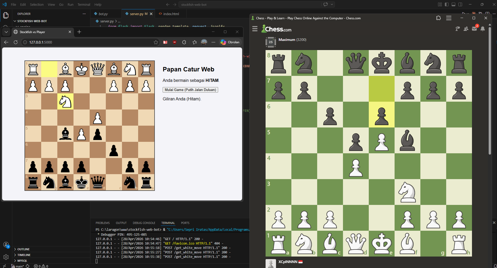

````md
# DeepKnight Web ♟️

**DeepKnight Web** adalah aplikasi catur interaktif berbasis web yang menggabungkan kecerdasan buatan dari **Stockfish Engine** dengan antarmuka modern dan responsif.  
Project ini mentransformasi logika AI Stockfish menjadi pengalaman bermain yang dinamis dengan fitur *drag-and-drop*, highlight langkah terakhir, dan visual papan yang lebih nyaman digunakan.

---

## 🚀 Deskripsi Project

Project ini dibangun untuk memberikan antarmuka visual yang intuitif bagi pengguna yang ingin bermain melawan AI catur berbasis **Stockfish**.

Menggunakan arsitektur **Client-Server**, backend Python dengan **Flask** bertanggung jawab untuk mengelola engine Stockfish sebagai otak permainan, sementara frontend JavaScript menangani tampilan papan catur, animasi bidak, validasi langkah, dan interaksi pengguna secara real-time di browser.

---

## 📂 Struktur Project

```text
chess_bot/
├── engine/                 # Folder executable Stockfish
│   └── stockfish-windows-x86-64.exe
│
├── templates/              # Folder tampilan utama (HTML)
│   └── index.html
│
├── static/                 # Folder asset (CSS, JS, gambar)
│
├── server.py               # Backend Flask (server utama)
│
└── README.md               # Dokumentasi project
````

---

## 🛠️ Instalasi

### 1. Prasyarat

Pastikan sudah menginstall:

* Python 3.10 atau versi terbaru
* Stockfish Engine (sesuaikan dengan sistem operasi)

Download Stockfish:
[https://stockfishchess.org/download/](https://stockfishchess.org/download/)

---

### 2. Install Library

Buka terminal atau CMD, lalu jalankan:

```bash
pip install flask stockfish
```

---

### 3. Konfigurasi Engine

Buka file `server.py`, lalu sesuaikan path Stockfish sesuai lokasi file di komputer Anda:

```python
STOCKFISH_PATH = r"C:\laragon\www\chess_bot\engine\stockfish-windows-x86-64.exe"
```

Contoh untuk Linux:

```python
STOCKFISH_PATH = "/home/user/chess_bot/engine/stockfish"
```

---

## 🖥️ Cara Menjalankan

### 1. Masuk ke direktori project

```bash
cd chess_bot
```

### 2. Jalankan server Flask

```bash
python server.py
```

### 3. Buka browser

Akses alamat berikut:

```text
http://127.0.0.1:5000
```

### 4. Mulai Bermain

Klik tombol **"Mulai Game"** untuk memulai permainan dan melihat langkah pembuka dari AI.

---

## 📸 Tampilan Aplikasi

### Preview Papan Catur



---

## 🧰 Tech Stack

### Backend

* Python
* Flask

### AI Engine

* Stockfish Chess Engine

### Frontend

* HTML
* CSS
* JavaScript

### Library Tambahan

* Chessboard.js → Visual papan catur
* Chess.js → Validasi langkah dan logika permainan

### Styling

* Custom CSS
* Highlight transparan untuk langkah terakhir
* UI modern ala Chess.com

---

## ✨ Fitur Utama

* Bermain melawan AI Stockfish
* Drag and Drop bidak
* Highlight langkah terakhir
* Validasi langkah otomatis
* Antarmuka modern dan responsif
* Backend terintegrasi dengan Flask API
* Mudah dikembangkan untuk fitur tambahan

---

## 🔮 Pengembangan Selanjutnya

Beberapa fitur yang bisa ditambahkan:

* Timer permainan
* Efek suara langkah bidak
* History langkah (PGN)
* Save & Load permainan
* Mode difficulty bot (Easy / Medium / Hard)
* Analisis langkah terbaik
* Multiplayer online

---

## 🤝 Kontribusi

Project ini bersifat open-source.

Jika Anda ingin menambahkan fitur baru atau melakukan perbaikan, silakan:

1. Fork repository ini
2. Buat branch baru
3. Lakukan perubahan
4. Commit perubahan
5. Kirim Pull Request

Kontribusi sekecil apa pun sangat dihargai ♟️

---

## 👨‍💻 Author

**Sepri Iratas**

Jika project ini membantu, jangan lupa ⭐ repository ini.

```
```
